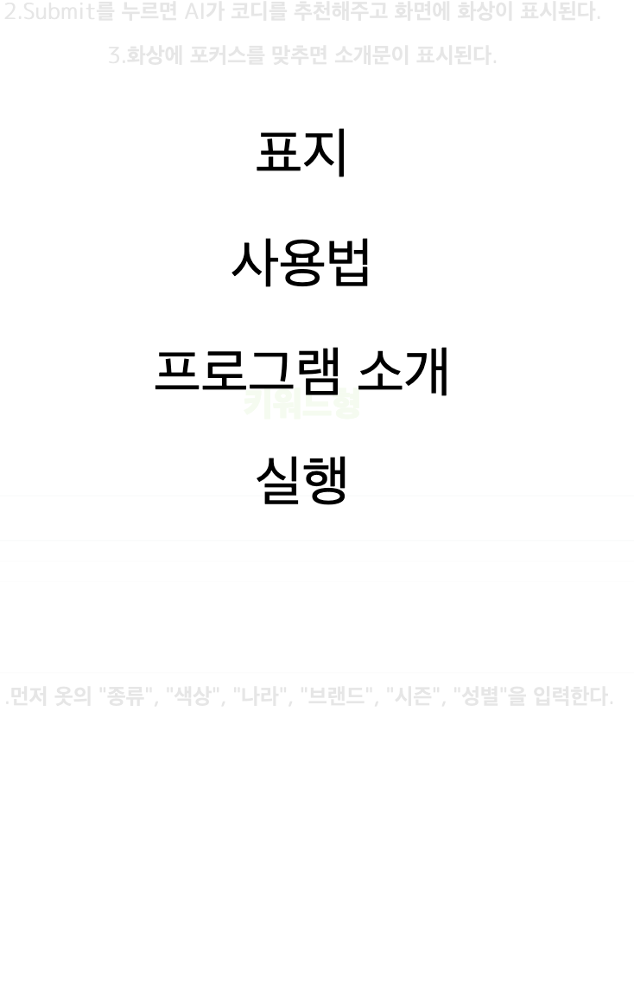
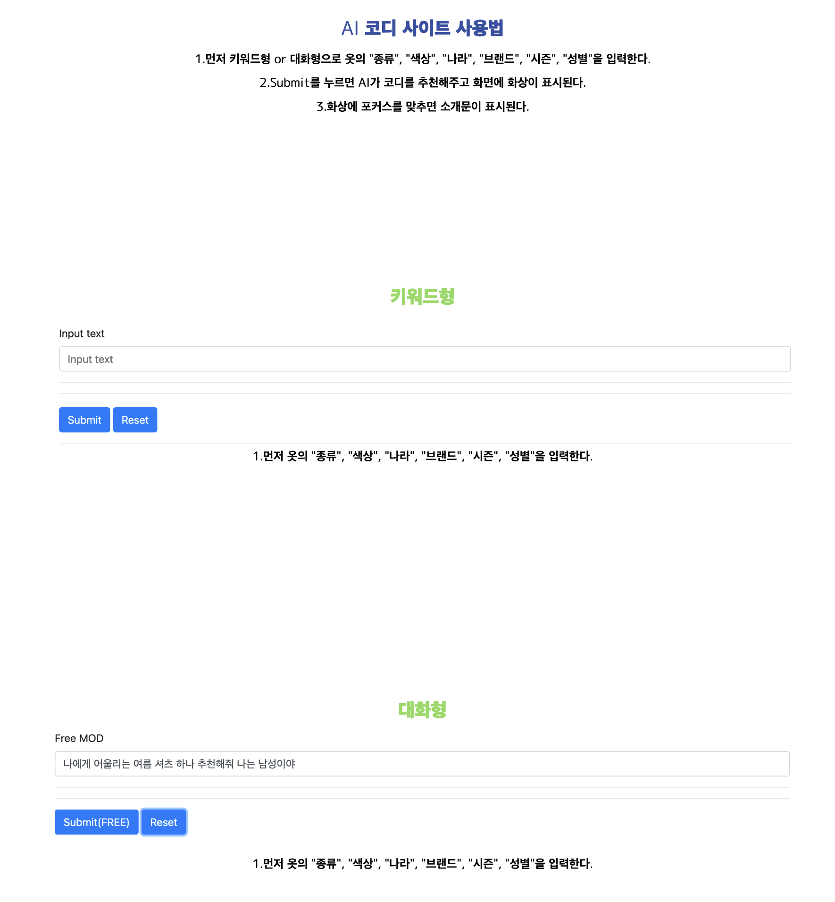
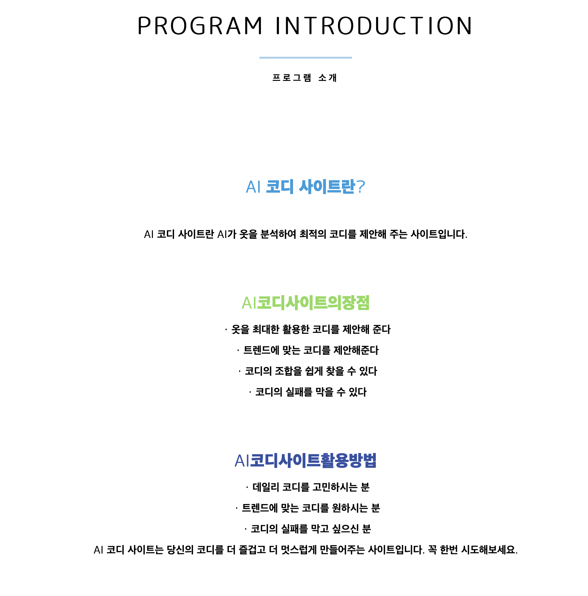
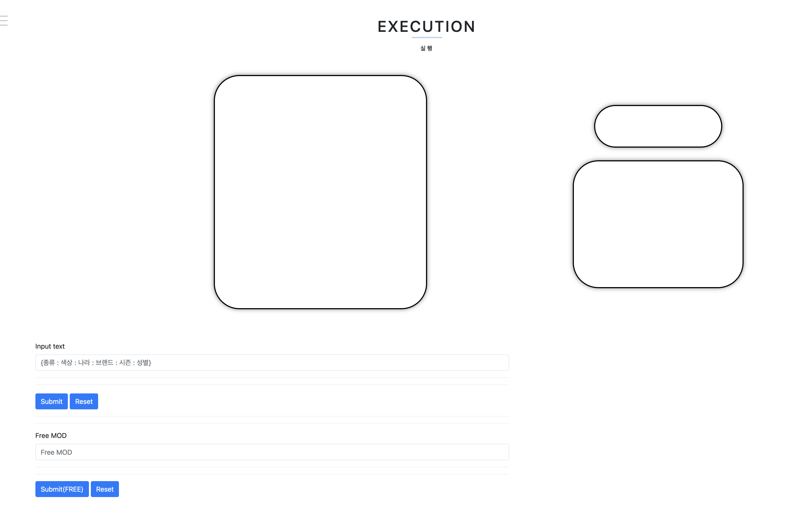

<p align='center'>
    
</p>
<br>

### 목차
- [Project 개요](#intro)
- [Project 주제](#subject)
- [팀원](#team)
- [System Architecture](#sa)


# SW Project
소프트웨어 프로젝트에서 진행한 <font size="3"><b>코디 추천 시스템을 탑재한 웹사이트 개발 Project</b></font> 입니다.

## <a id="intro">Project 개요</a>
'어떤 옷을 입을지' , '어떤 옷을 살지' 등등 평소에 옷에 대해서 고민하는 시간이 모두 있다고 생각합니다.

실제로 , 옷을 고르는데 쓰는 시간은 하루에 평균 17분 , 남성의 경우도 여성과 같이 옷을 고르면서 고민하는데 시간을 많이 쓴 경험은 3분의 1이 있다고 했습니다.

<font size="3"><b>참고 뉴스 URL : [https://nownews.seoul.co.kr/news/newsView.php?id=20160606601014](https://nownews.seoul.co.kr/news/newsView.php?id=20160606601014)</b></font>

## <a id="subject">Project 주제</a>
<b>자신이 입고 싶거나 , 고민하고 있는 종류의 옷등의 조건을 기준으로 해서 옷을 추천해줄 수 있는 그러한 인공지능을 탑재한 웹사이트가 있으면 , 의사결정에 도움이 될 것 같다는 생각에서 Project의 주제를 "코디 추천 시스템을 탑재한 웹사이트 개발 Project</b>로 하였습니다.

## <a id='team'>팀원</a>
|김대양|태정수|아타케 마사아키|아베 다카노부|
|:---:|:---:|:---:|:---:|
|||||
|[Dae-yangKim](https://github.com/Dae-yangKim)|[taejungsu](https://github.com/taejungsu)|[MasaakiAtake](https://github.com/MasaakiAtake)|[ABETAKANOBU](https://github.com/ABETAKANOBU)|
|AI , DB 개발| 백엔드 기능 구현 및 서버 연결 | 프론트엔드 개발 및 UI 설계 , 구현 | 프론트엔드 개발 및 디자인 |

## Stacks

### 🛠️ 개발 환경
   

### 🛠️ 프론트엔드
   

### 🛠️ 백엔드
  

### 🛠️ DB


### 🛠️ AI 모델
  
 

## <a id='sa'>System Architecture</a>


## 📅 개발 기간
| 개발 | 기간 |
| :---: | :---: |
| 전체 | 2023-04 ~ 2023-06 | 
| 백엔드 | 2023-04 ~ 2023-06 |
| 프론트 엔드 | 2023-05 ~ 2023-06 |

## 코드 실행
```
npm run start
```

웹 사이트를 배포하지 않았기 때문에 , React로 로컬 서버를 실행시켜서 웹사이트를 방문하실 수 있습니다.

## 참고 사진

 

<font size=3>웹 사이트의 메뉴에서는 이렇게 4가지가 있습니다.</font>

- 표지 : 접속하면 제일 처음으로 들어가지는 페이지이며 , 개발자 사진이 있습니다.
- 사용법 : 사진과 함께 , 사용자가 이용할 수 있는 기능에 대해서 설명을 하는 페이지 입니다.
- 프로그램 소개 : 만든 취지와 장점 , 활용방법을 설명하는 페이지 입니다.
- 실행 : 프로그램 실행 페이지 입니다.

<br>

| 사용법 페이지 | 프로그램 소개 페이지 | 실행 페이지 |
| :---: | :---: | :---: |
|||
